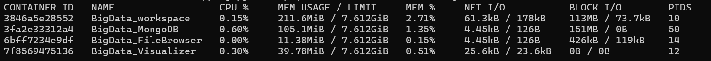
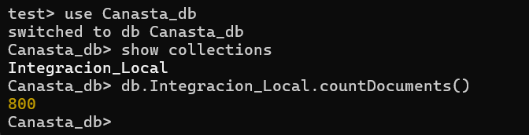
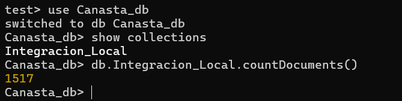
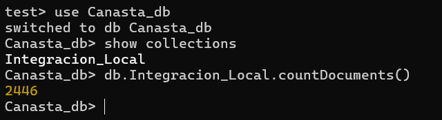
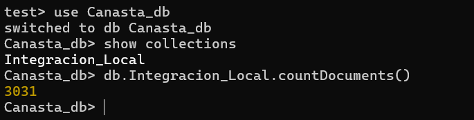
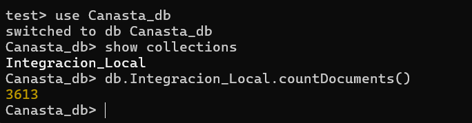
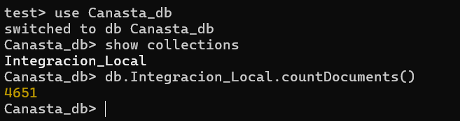
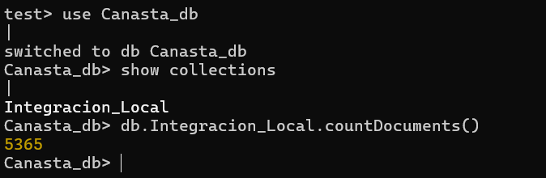
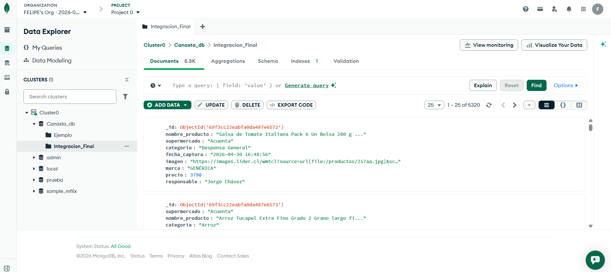

# Retail Alimenticio – Los Ave Mayo

### 👥 Integrantes:
*   Jorge Chávez
*   Mariana Ferreira
*   Renato Gutiérrez
*   Felipe Gutiérrez
*   Isidora Matus
*   Franco Paredes
*   Franco Teyssandier

---

## 1. Situación Problema
En el contexto actual de la economía chilena, el costo de la Canasta Básica de Alimentos se ha convertido en una preocupación para familias y analistas de mercado. ¿La razón?, la decisión de "¿dónde comprar?" se sigue tomando mayoritariamente a ciegas o mediante métodos manuales ineficientes.

**Los desafíos que provocan el "a ciegas":**
*   **Seguimiento Manual y Fragmentado:** Hoy en día, comparar el precio de un mismo producto (como el arroz o el aceite) requiere visitar múltiples sitios web de cadenas nacionales y locales, cada uno con formatos, unidades de medida y promociones distintas.
*   **Información Desactualizada:** Las organizaciones y consumidores dependen de la recolección manual de datos, la cual queda obsoleta en cuestión de horas debido a la alta volatilidad de precios y ofertas relámpago en el sector retail.
*   **El Punto Ciego Regional:** Existe una brecha de transparencia significativa entre las grandes cadenas nacionales y los supermercados regionales o pequeños. Sin una herramienta de integración, es imposible saber si el ahorro real está en el gigante del retail o en el comercio local.
*   **Decisiones por Intuición:** Ante la falta de un consolidado de datos en tiempo real, las decisiones de abastecimiento y presupuesto se toman por "hábito" o "lealtad de marca", perdiendo oportunidades críticas de optimización económica por no tener una visión panorámica del mercado.

---

## 2. Propuesta de Valor: Inteligencia de Datos para el Consumo Masivo
Nuestra solución de Scraping cambia la recolección de información en una ventaja estratégica, al centralizar datos de múltiples fuentes del Retail Alimenticio basada en datos objetivos y actualizados es posible analizar el comportamiento del mercado.

**¿Cómo cambia esto la toma de decisiones?**
*   **De Percepciones a Datos Objetivos:** Sustituimos intuición por un sistema basado en datos reales, eliminando la subjetividad en la comparación entre distintos tipos de supermercados.
*   **Análisis de Elasticidad de la Canasta:** Al automatizar la extracción masiva, es posible evaluar con precisión cómo fluctúan los precios de los productos clave de la canasta básica chilena, identificando qué cadenas lideran las alzas o bajas en tiempo real.
*   **Transparencia de Mercado:** Hacemos visible la brecha de precios entre grandes cadenas nacionales y comercios regionales, permitiendo una toma de decisiones informada sobre dónde es realmente más competitivo abastecerse.
*   **Eficiencia en el Análisis de Competitividad:** La organización deja de ser reactiva frente a los precios de la competencia para convertirse en un actor que analiza comportamientos de mercado con datos objetivos y estructurados.

---

## 3. Análisis de las 4V Iniciales

### Volumen:
Para que el análisis de la Canasta Básica no sea un simple sondeo, requerimos una masa crítica de datos que permita identificar patrones reales.
*   **Escala del Proyecto:** Al recolectar >3.000 registros totales (mínimo 500 por cada uno de los 6 integrantes), logramos una cobertura representativa de los diversos productos disponibles en el mercado.
*   **Poder Estadístico:** Este volumen asegura que los promedios de precios por categoría (como Lácteos o Despensa) sean precisos y no se vean distorsionados por casos aislados, permitiendo una comparación robusta entre cadenas.

### Variedad:
Extraer solo el precio es insuficiente para una toma de decisiones inteligente, debido a esto, capturamos 8 etiquetas específicas para construir un perfil para cada producto:
*   **Identificación:** Nombre, Marca y Categoría para asegurar que comparamos "manzanas con manzanas" entre distintos supermercados.
*   **Atributos de Valor:** Imagen y Supermercado para validar visualmente el producto y su origen.
*   **Trazabilidad:** Fecha de captura y Responsable para garantizar el orden y la autoría de los datos dentro del equipo Los Ave Mayo.

### Veracidad:
Garantizamos la calidad de nuestra información mediante procesos de:
*   **Limpieza:** Aplicamos filtros para eliminar símbolos de moneda ($), puntos de miles y caracteres especiales, transformando el texto en valores Integer/Decimal operables matemáticamente.
*   **Normalización de Precios:** Se descartan precios con descuentos temporales para capturar el "precio base" real, evitando sesgos por ofertas de corta duración.
*   **Consistencia:** Validamos que cada registro cumpla con el formato técnico antes de su persistencia en MongoDB.

### Velocidad:
En el sector retail alimenticio, la información tiene una fecha de vencimiento muy corta.
*   **Frecuencia Recomendada:** Debido a la alta volatilidad del mercado chileno, el scraper debería ejecutarse con una frecuencia diaria.
*   **Evitar la Obsolescencia:** Una captura semanal o mensual dejaría la toma de decisiones obsoleta, ya que los cambios de precios por inflación o competencia ocurren en ciclos de 24 a 48 horas.

---

## 4. Tabla de Atributos Estandarizada
Para asegurar la calidad de los datos recolectados por todos los integrantes del equipo, se definió un esquema común de extracción:

| Atributo | Tipo de Dato | Descripción | Ejemplo |
| :--- | :--- | :--- | :--- |
| `nombre_producto` | String | Nombre descriptivo completo del artículo | Arroz Tucapel Gran largo 1kg |
| `precio` | Integer | Valor numérico limpio (sin puntos ni símbolos) | 1890 |
| `supermercado` | String | Fuente de origen del dato | Santa Isabel |
| `categoria` | String | Clasificación dentro de la canasta básica | Despensa |
| `marca` | String | Fabricante o marca propia del retail | Tucapel |
| `fecha_captura` | ISO Date / String | Timestamp exacto de la extracción | 2026-04-30 15:45:00 |
| `imagen` | String (URL) | Enlace directo a la fotografía del producto | https://imagenes.../foto.jpg |
| `responsable` | String | Nombre del integrante que realizó el scraping | Felipe Gutierrez |

> **Nota sobre la integridad:** Todos los integrantes capturamos estas mismas etiquetas para permitir cruces de información, comparativas de precios por marca y análisis de participación por supermercado dentro de la Canasta_db, la diferencia radica en el supermercado donde se realizó el scraping o las categorías dentro de uno.

---

## 5. Guía de Ejecución: Despliegue y Carga de Datos

### 1. Preparación del Entorno
Clona el repositorio oficial y accede a la carpeta de trabajo:
```bash
git clone https://github.com/IICG-Coquimbo/proyecto-big-data-2026-retail-a
cd proyecto-big-data-2026-retail-a
```

### 2. Instalación de Dependencias
Se recomienda el uso de un entorno virtual:
```bash
pip install -r requirements.txt
```
*Nota: El archivo `requirements.txt` incluye pymongo, selenium, beautifulsoup4 y las herramientas de limpieza necesarias.*

### 3. Despliegue de Infraestructura (Docker)
Levanta los contenedores en segundo plano (MongoDB, Workspace, Visualizer, FileBrowser):
```bash
docker-compose up -d
```
*Puedes verificar el estado con `docker-compose ps`.*

### 4. Ejecución del Orquestador y Carga Local
Para activar los scrapers y guardar los registros en la base de datos local:
```bash
python main.py
```

---

## 6. Evidencias de Ejecución

### Evidencia 1: Salud de los Contenedores
En la siguiente captura se observa el comando `docker stats`, el cual confirma que los cuatro servicios del ecosistema (MongoDB, Workspace, FileBrowser y Visualizer) están operativos y consumiendo recursos de manera eficiente dentro de los límites establecidos.



### Evidencia 2: Persistencia y Conteo de Datos
Tras la ejecución del orquestador, se valida la persistencia en la base de datos Canasta_db, las capturas muestran el conteo de documentos en la colección `Integracion_Local`, superando el umbral mínimo de 500 registros requeridos para cada integrante.

| Felipe Gutiérrez | Franco Teyssandier |
| :---: | :---: |
|  |  |

| Jorge Chávez | Mariana Ferreira |
| :---: | :---: |
|  |  |

| Franco Paredes | Renato Gutiérrez |
| :---: | :---: |
|  |  |

| Isidora Matus | Consolidado Atlas |
| :---: | :---: |
|  |  |
